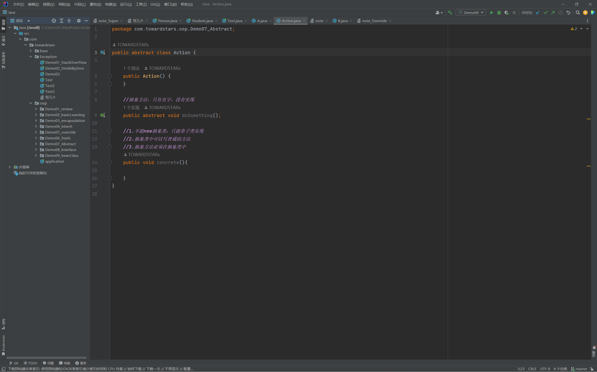

part1 科学上网

part2 IDE（已安装，在使用）

part3 typora（正在学习markdown语法）

part4 Git

[TOWARDSTARs (github.com)](https://github.com/TOWARDSTARs)主页

git只会基本语法（init add commit push clone checkout switch branch等）

part4 java在复习（见上文ide图）

（待完成：Linux