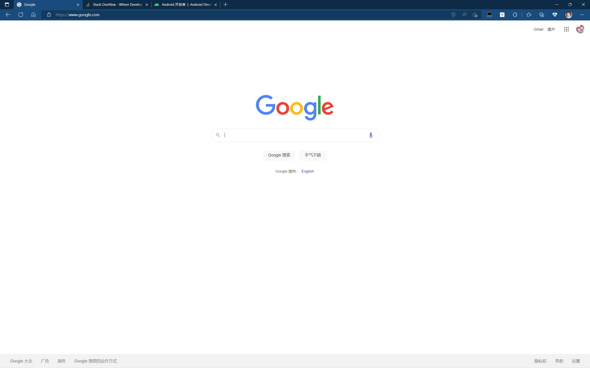
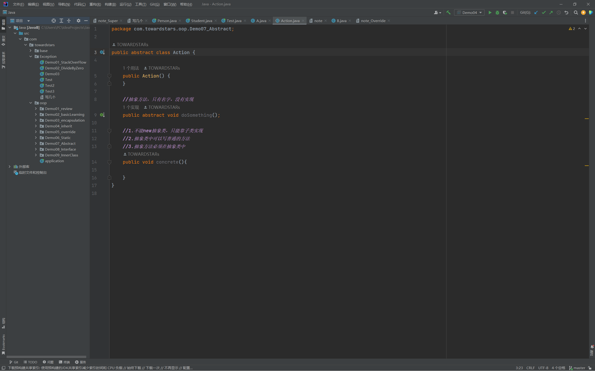
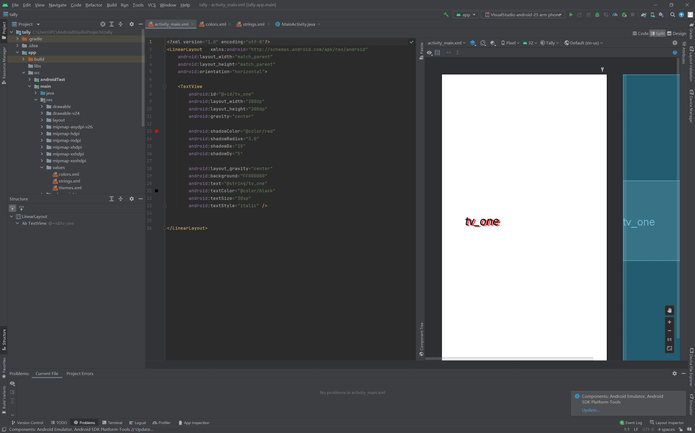
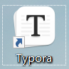

# DAY 1

### part1 科学上网

### part2 IDE（已安装，在使用）

### part3 typora（正在学习markdown语法）

### part4 Git

[TOWARDSTARs (github.com)](https://github.com/TOWARDSTARs)主页

git只会基本语法（init add commit push clone checkout switch branch等）

### part4 java在复习（见上文ide图）

### （待完成：Linux

# DAY2

### 睡觉、赶实训报告ddl和失败的linux安装尝试（进展≈0）

### 原因是教程稍微古老，而一些问题难以解决，加之自己担心数据损失或者wipe windows in seconds

# DAY3

# **Linux安装报告**

### 目前（算是）成功安装了Linux ，目前部分软件和中文包尚未安装

### 安装Linux大致用了两天（大部分时间在摸鱼），鉴于昨天的日报写得比较水，今天就大致整体总结一下过程、遇到的问题和解决办法

1.最开始的时候过于小心，主要是担心把数据删掉，后续恢复困难，再就是担心wipe Windows in seconds，但是还算顺利，做好了Win10这边的一些准备工作

2.第一系列问题是选取的教程相关，刚开始选取的教程已有年头，尽管前辈写的足够详尽，但在今日看来依然有一些问题说明的并不够完善，后续使用了junkfood02前辈的教程，大致解决了第一系列问题。

第一系列问题：

- BIOS相关，第一次进入BIOS界面，不知道关闭Secure Boot，没查到此型号电脑应该怎么做才算是调整启动顺序，也没开启默认网卡（悲）

- 不知道怎么调整网卡的运行状态（实际为ip link set wlan0 up）

- 最开始选择连接自己手机的热点（因为忘记家里WiFi密码了），结果无法执行ping www.baidu.com，导致困惑许久（后来连了家里WiFi，就可以访问www.baidu.com了，现在也没弄明白原因）

- 第一次创建引导分区的时候，输入t之后出现了意想不到的问题，当时我认为是又创建了一个新分区（实际上应该是并没有），后续在确认无事之后shutdown了系统，算是告一段落

3.其余的问题大致是

- 对某些warning的含义的查找，担心自己安装过程出错

- 没仔细学习vim的使用，导致一些操作的小问题

- 不了解退出chroot模式的方式

- 不知道安装软件包时出的warning是不是可以忽略的（因为翻译大意是没有连接网络）（虽然教程中提到warning无需理会）

- grub安装和部署过程中因为平板电脑的浏览器的一些问题（竖着放导致一部分代码被挤出屏幕而没有显示）导致安装系统不执行命令（幸好没执行，不然说不准会不会有什么悲剧）（悲）

  

  ### 后续安装图形界面很顺利，但是重启进入系统之后，对Linux的操作并不熟悉（比如就不知道应该在哪里输入代码，后来意识到应该是在终端），而且安装应用也并不顺利（不知道怎么设置权限为可执行），于是也没有安装clash，然后一些内容也难以上传github，再就是安装yay的时候，需要sudo，但是su的密码和我设置的两个用户都不一样，就是既不同于root的密码，也不同于开机密码（悲），还有关于gpu驱动的选取，还需要仔细研究一下

  ### 更新：关于su和sudo，su是switch user的含义，所以关于密码的误会需要解除

  ### 补充：使用markdown过程中对于开源的感悟：

 - Markdown是一种轻量级标记语言，创始人为约翰·格鲁伯。它允许人们使用易读易写的纯文本格式编写文档，然后转换成有效的XHTML（或者HTML）文档。[4]这种语言吸收了很多在电子邮件中已有的纯文本标记的特性。由于Markdown的轻量化、易读易写特性，并且对于图片，图表、数学式都有支持，目前许多网站都广泛使用Markdown来撰写帮助文档或是用于论坛上发表消息。如GitHub、Reddit、Diaspora、Stack Exchange、OpenStreetMap 、SourceForge、简书等，甚至还能被用来撰写电子书。

 - （摘自markdown-维基百科[https://zh.m.wikipedia.org/wiki/Markdown]）

 - 受指点后发现docx和md在开源方面的区别，也意识到了长远看来markdown的一些优势（尤其是安全性，或者说一种抽象但必要的公平性）

